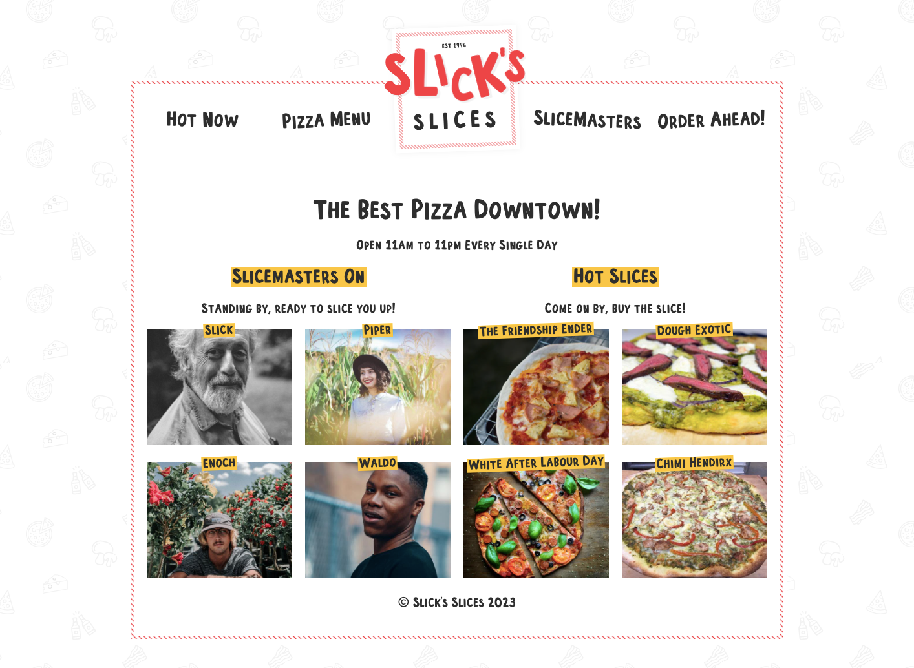

<h1 align="center">Slicks Slices</h1>

The "Slick's Slices" project is a mock pizza restaurant's website powered by Gatsby, where the customer can design and order their own pie. The back end CMS is powered by Sanity, so the fictional restaurant manager can easily update the site to show which "Slicemasters" are currently on shift and which pizzas and toppings are available.

About Project:
<ul>
<li>Build a website from scratch using Gatsby</li>
<li>Source data from the Sanity CMS</li>
<li>Generate an order confirmation email</li>
<li>Use scoped CSS, tags and filtering, and progressive images</li>
</ul>

<table>
  <tr>
    <td valign="top"></td>
    <td valign="top"></td>
    <td valign="top"></td>
    </tr>
</table>
<table>
